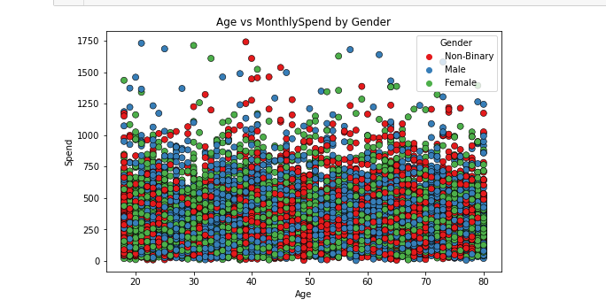
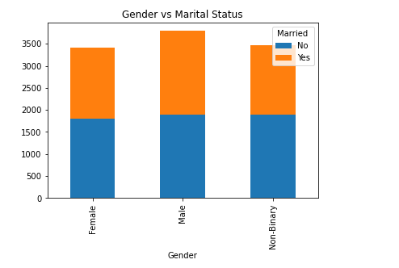

# 📊 Customer Insights: Exploratory Data Analysis (EDA) & Statistical Analysis

## 📌 Project Overview

This project performs **Exploratory Data Analysis (EDA)** and **Statistical Analysis** on a US Customer Insights dataset to understand customer demographics, spending behavior, engagement patterns, and business opportunities.

The analysis includes data cleaning, descriptive statistics, visualizations, correlation analysis, hypothesis testing, and business recommendations to support data-driven decision making.

---

## 🎯 Project Objectives

- Clean and prepare the dataset for analysis.
- Understand customer demographics.
- Analyze customer spending behavior.
- Identify relationships between variables.
- Validate business assumptions using statistical tests.
- Generate actionable business insights.

---

## 🛠️ Tools Used

- Python
- Pandas
- NumPy
- Matplotlib
- Seaborn
- SciPy

---

## 📂 Dataset

The dataset contains 10,675 customer records with the following fields:
 
| Column | Description |
|---|---|
| CustomerID | Unique customer identifier |
| Name | Customer name |
| State | US state of residence |
| Education | Highest education level (High School, Associate, Bachelor, Master, PhD) |
| Gender | Male / Female / Non-Binary |
| Age | Customer age |
| Married | Marital status |
| NumPets | Number of pets owned |
| JoinDate | Date customer joined |
| TransactionDate | Date of most recent transaction |
| MonthlySpend | Average monthly spend ($) |
| DaysSinceLastInteraction | Recency of last interaction (days) |
 
---

## 📋 Project Workflow


### 1. Data Understanding

- Loaded dataset using Pandas
- Checked data types
- Identified missing values
- Checked duplicate records
- Examined unique values

---

### 2. Data Cleaning

- Verified dataset quality
- Converted date columns into datetime format
- Prepared dataset for analysis

---

### 3. Descriptive Statistics

Calculated:

- Mean
- Median
- Standard Deviation
- Minimum & Maximum values
- Distribution of numerical variables
- Mode for categorical variables
- Skewness

---

### 4. Exploratory Data Analysis (EDA)

Performed analysis on:

- Age Distribution
- Monthly Spending
- Customer Engagement
- Gender-wise Spending
- Education-wise Spending
- State-wise Spending
- Marital Status Analysis

Visualizations include:

- Histograms
- Boxplots
- Bar Charts
- Scatter Plots
- KDE Plots
- Correlation Heatmap
- Stacked Bar Charts

## Age Distribution


---
## Montly Spend-Box Plot


---
## Gender-wise Spending


---

## Education-wise Spending


---
## Total Spending By State


---
## Age vs Monthly Spend By Gender


---
## Spendig Behaviour By Education Level


---
## Spending Behaviour By Martial Status


---
## Gender V/S Marital Status



---
## Correlation Heatmap


### 5. Correlation Analysis

Analyzed relationships among numerical variables using:

- Pearson Correlation Matrix
- Heatmap Visualization

#### Findings
  - Weak correlations observed among numerical variables
#### Business Insight
  - No single customer attribute strongly explains spending behavior.
  - Customer purchasing decisions appear to be influenced by multiple factors rather than one dominant variable.

---

### 6. Hypothesis Testing

 Performed statistical tests including:
  All tests were conducted using:
   - Confidence Level = 95%
   - Significance Level (α) = 0.05

## 1️⃣ Gender vs Monthly Spend

### Business Question

Do males and females spend differently?

### Test Used

Independent Two-Sample T-Test

### Results

| Metric  | Value  |
| ------- | ------ |
| p-value | 0.7345 |

### Decision

Fail to reject the null hypothesis.

### Business Insight

No statistically significant spending difference exists between male and female customers.

### Recommendation

Avoid gender-based pricing or promotional strategies.

---

## 2️⃣ Education Level vs Monthly Spend

### Business Question

Does education level impact spending?

### Test Used

One-Way ANOVA

### Results

| Metric  | Value  |
| ------- | ------ |
| p-value | 0.9224 |

### Decision

Fail to reject the null hypothesis.

### Business Insight

Educational qualification does not significantly influence customer spending.

### Recommendation

Segment customers based on behavior rather than education level.

---

## 3️⃣ Marital Status vs Pet Ownership

### Business Question

Is marital status related to pet ownership?

### Test Used

Chi-Square Test of Independence

### Results

| Metric  | Value        |
| ------- | ------------ |
| p-value | 2.40 × 10⁻³⁷ |

### Decision

Reject the null hypothesis.

### Business Insight

A strong relationship exists between marital status and pet ownership.

### Recommendation

Develop pet-focused campaigns tailored to different marital segments.

---

## 4️⃣ Age vs Customer Activity

### Business Question

Are older customers less active?

### Test Used

Pearson Correlation Significance Test

### Results

| Metric  | Value  |
| ------- | ------ |
| p-value | 0.6817 |

### Decision

Fail to reject the null hypothesis.

### Business Insight

Older customers are not less active than younger customers.

### Recommendation

Engagement strategies should focus on customer behavior rather than age demographics.

---

## 5️⃣ State-wise Spend Analysis

### Business Question

Does average spending vary across states?

### Test Used

One-Way ANOVA

### Results

| Metric  | Value  |
| ------- | ------ |
| p-value | 0.3457 |

### Decision

Fail to reject the null hypothesis.

### Business Insight

Average customer spending remains statistically similar across states.

### Recommendation

State-level marketing budgets should focus on customer volume rather than expected spending differences.

---

## 📈 Key Insights

 ### 1. High-Value Customers Drive Revenue
    
   ▪ Approximately 20–25% of customers contribute nearly 60–70% of total revenue, as indicated by the right-skewed spending distribution.

#### ✔ Business Action:

   🔸 Focus on retaining high-value customers
   🔸 Introduce loyalty programs & premium offers

### 2. Education Level Influences Spending Behavior

  ▪ Customers with higher education (Master’s/PhD) spend approximately 15–25% more on average compared to lower education       groups.

#### ✔ Business Action:
    
   🔸 Target premium segments
   🔸 Use education/income-based marketing
    

### 3. Gender Has Minimal Impact on Spending

   ▪ T-test results indicate no statistically significant difference in spending between male and female customers.

#### ✔ Business Action:

   🔸 Avoid gender-based targeting
   🔸 Focus on behavioral segmentation instead

### 4. Customer Engagement is a Key Driver
   
  ▪ Customers inactive for more than 60 days show ~30–40% lower engagement, leading to reduced spending patterns.

#### ✔ Business Action:

   🔸 Launch re-engagement campaigns (email/SMS)
   🔸 Target customers inactive for 30–60 days

### 5. Geographic Differences Affect Spending
   
  ▪ Top-performing states show 20–30% higher average spending compared to lower-performing regions.

#### ✔ Business Action:

   🔸 Implement location-based marketing strategies
   🔸 Customize offers based on regional preferences

### 6. Customer Behavior is Multi-Dimensional
  
  ▪ No single factor explains more than 30% of spending variation, indicating customer behavior is multi-dimensional.

#### ✔ Business Action:

   🔸 Use multi-factor segmentation (education + engagement + location)
   🔸 Avoid relying on a single variable for decision-making

## 💼 Business Recommendations

- Focus on retaining high-value customers through loyalty programs.
- Implement re-engagement campaigns for inactive customers.
- Use personalized marketing instead of demographic-based targeting.
- Apply similar marketing strategies across different states.
- Increase customer engagement to improve long-term retention.

---

## 📊 Statistical Techniques Used

- Descriptive Statistics
- Distribution Analysis
- Correlation Analysis
- Independent Samples T-Test
- One-Way ANOVA
- Confidence Interval Estimation

---

## 📁 Project Structure

```
customer-insights-eda
│
├── Customer_insights_eda.ipynb
├── Customer_insight_eda.html
├── US_Customer_Insights_Dataset.csv
├── README.md
├── requirements.txt
├── .gitignore
│
└── Screenshot/
    ├── Age_Distribution.png
    ├── Age_vs_MonthlySpend_by_gender.png
    ├── Avrage_spending_by_gender.png
    ├── Avrage_spending_on_education.png
    ├── Correlation_Matrix.png
    ├── Gender_vs_Marital_Status.png
    ├── Monthly_spend_Box_Plot.png
    ├── Spending_Behaviour_By_Marital_Status.png
    ├── Spending_Behaviour_by_education_level.png
    ├── Total_Spending_By_Gender.png
    ├── Total_Spending_By_State.png
    ├── Total_Spending_on_education.png
    ├── Spending_Behaviour_by_education_level.png
    └── Total_Spending_By_Gender.png


---

## 🚀 How to Run

1. Clone this repository

```bash
git clone https://github.com/yourusername/customer-insights-eda.git
```

2. Install required libraries

```bash
pip install pandas numpy matplotlib seaborn scipy
```

3. Open the Jupyter Notebook

```bash
jupyter notebook
```

4. Run all cells.

---

## 📚 Statistical Techniques Applied

 - Descriptive Statistics
 - Distribution Analysis
 - Boxplots & Histograms
 - Correlation Analysis
 - Independent T-Test
 - One-Way ANOVA
 - Chi-Square Test of IndependencePearson
 - Correlation Test

---

## 📬 Contact

**Rudraksha Sharma**

- LinkedIn: https://www.linkedin.com/in/rudrakshasharma99/
- GitHub: https://github.com/RudrakshaSharma99

---

⭐ If you found this project useful, consider giving it a **Star** on GitHub!
