# 📊 Customer Insights: Exploratory Data Analysis (EDA) & Statistical Analysis

## 📌 Project Overview

This project performs **Exploratory Data Analysis (EDA)** and **Statistical Analysis** on a US Customer Insights dataset to understand customer demographics, spending behavior, engagement patterns, and business opportunities.

The analysis includes data cleaning, descriptive statistics, visualizations, correlation analysis, hypothesis testing, and business recommendations to support data-driven decision making.

---

## 🎯 Project Objectives

- Clean and prepare the dataset for analysis.
- Understand customer demographics.
- Analyze customer spending behavior.
- Identify relationships between variables.
- Validate business assumptions using statistical tests.
- Generate actionable business insights.

---

## 🛠️ Technologies Used

- Python
- Pandas
- NumPy
- Matplotlib
- Seaborn
- SciPy

---

## 📂 Dataset

The dataset contains 10,675 customer records with the following fields:
 
| Column | Description |
|---|---|
| CustomerID | Unique customer identifier |
| Name | Customer name |
| State | US state of residence |
| Education | Highest education level (High School, Associate, Bachelor, Master, PhD) |
| Gender | Male / Female / Non-Binary |
| Age | Customer age |
| Married | Marital status |
| NumPets | Number of pets owned |
| JoinDate | Date customer joined |
| TransactionDate | Date of most recent transaction |
| MonthlySpend | Average monthly spend ($) |
| DaysSinceLastInteraction | Recency of last interaction (days) |
 
---

## 📋 Project Workflow


### 1. Data Understanding

- Loaded dataset using Pandas
- Checked data types
- Identified missing values
- Checked duplicate records
- Examined unique values

---

### 2. Data Cleaning

- Verified dataset quality
- Converted date columns into datetime format
- Prepared dataset for analysis

---

### 3. Descriptive Statistics

Calculated:

- Mean
- Median
- Standard Deviation
- Minimum & Maximum values
- Distribution of numerical variables
- Mode for categorical variables
- Skewness

---

### 4. Exploratory Data Analysis (EDA)

Performed analysis on:

- Age Distribution
- Monthly Spending
- Customer Engagement
- Gender-wise Spending
- Education-wise Spending
- State-wise Spending
- Marital Status Analysis

Visualizations include:

- Histograms
- Boxplots
- Bar Charts
- Scatter Plots
- KDE Plots
- Correlation Heatmap
- Stacked Bar Charts

## Age Distribution

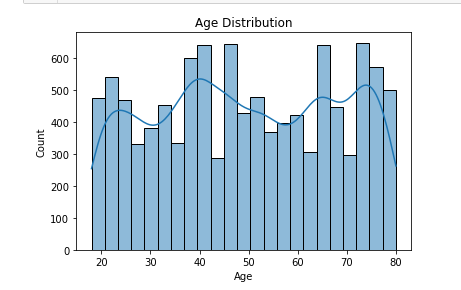

---
## Montly Spend-Box Plot

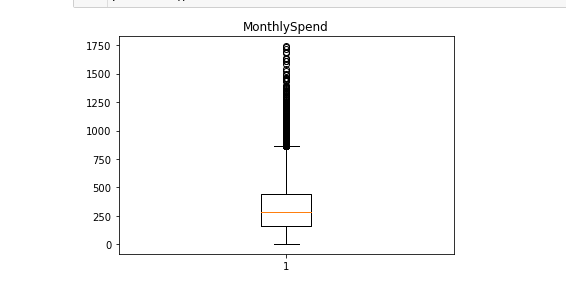

---
## Gender-wise Spending

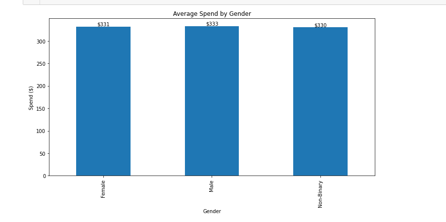

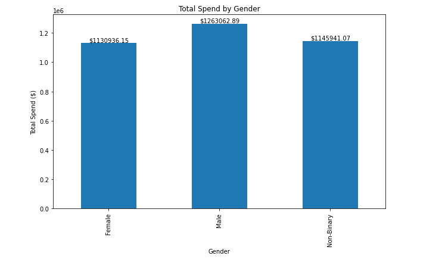

---

## Education-wise Spending

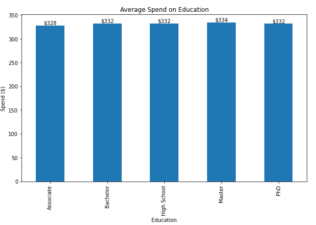

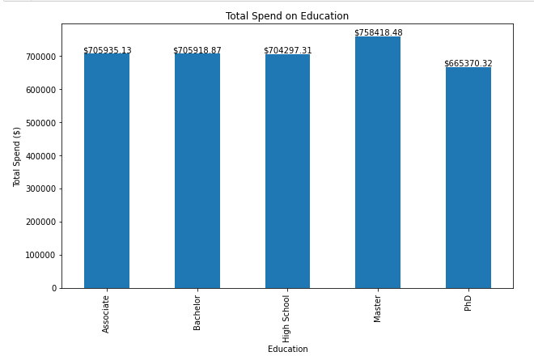

---
## Total Spending By State

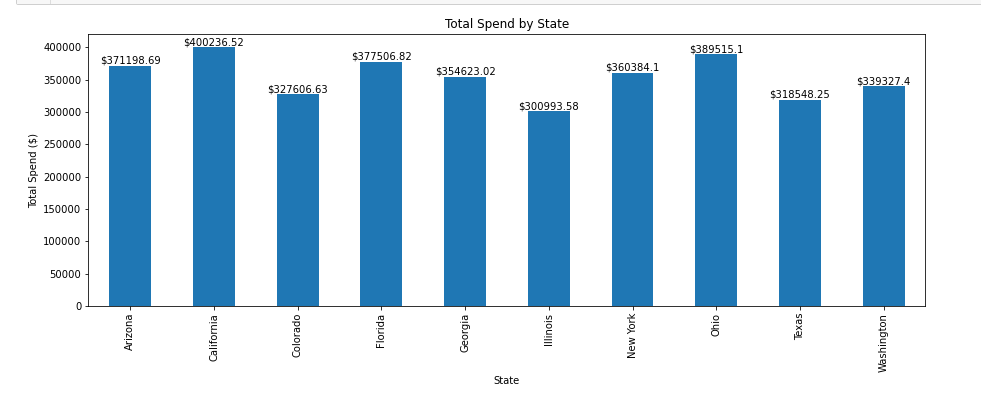

---
## Monthly Spending Distribution

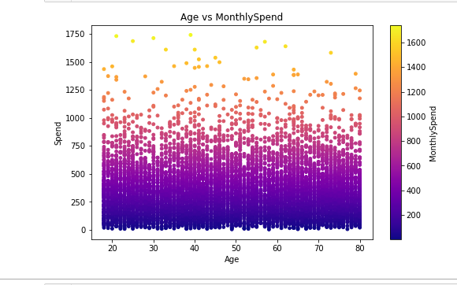
---
## Spendig Behaviour By Education Level

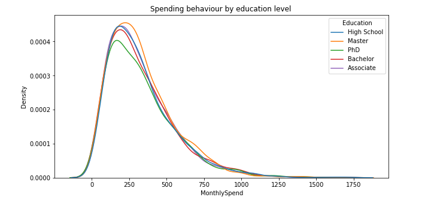

---
## Spending Behaviour By Martial Status

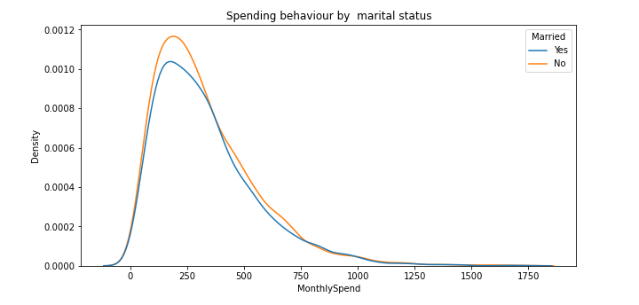

---
##Gender V/S Marital Status


---
## Correlation Heatmap

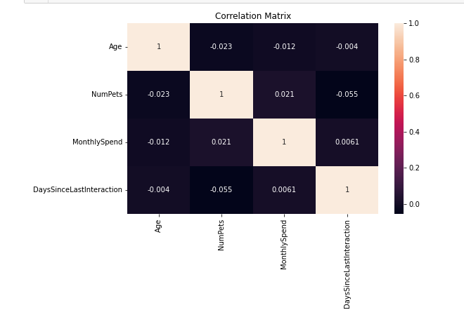

### 5. Correlation Analysis

Analyzed relationships among numerical variables using:

- Pearson Correlation Matrix
- Heatmap Visualization

---

### 6. Hypothesis Testing

Performed statistical tests including:

### Independent T-Test

**Question:**
Do male and female customers spend differently?

---

### One-Way ANOVA

**Question:**
Does education level significantly affect monthly spending?

---

### Correlation Analysis

**Question:**
Are older customers less active?

---

### State-wise ANOVA

**Question:**
Does customer spending differ across states?

---

## 📈 Key Insights

- Most customers belong to the working-age group (25–60 years).
- Around 75% of customers are low spenders.
- A small percentage of customers contribute a large portion of total revenue.
- Spending behavior is almost identical across genders.
- Education level has minimal impact on monthly spending.
- Customer age has almost no relationship with engagement.
- Spending differences across states are statistically insignificant.
- Customer spending is influenced by multiple behavioral factors rather than demographic variables alone.

---

## 💼 Business Recommendations

- Focus on retaining high-value customers through loyalty programs.
- Implement re-engagement campaigns for inactive customers.
- Use personalized marketing instead of demographic-based targeting.
- Apply similar marketing strategies across different states.
- Increase customer engagement to improve long-term retention.

---

## 📊 Statistical Techniques Used

- Descriptive Statistics
- Distribution Analysis
- Correlation Analysis
- Independent Samples T-Test
- One-Way ANOVA
- Confidence Interval Estimation

---

## 📁 Project Structure

```
customer-insights-eda
│
├── customer_insights_eda.ipynb
├── US_Customer_Insights_Dataset.csv
├── README.md
├── requirements.txt
│
└── images/
    ├── age_distribution.png
    ├── monthly_spending.png
    ├── gender_spending.png
    ├── education_spending.png
    ├── heatmap.png
```

---

## 🚀 How to Run

1. Clone this repository

```bash
git clone https://github.com/yourusername/customer-insights-eda.git
```

2. Install required libraries

```bash
pip install pandas numpy matplotlib seaborn scipy
```

3. Open the Jupyter Notebook

```bash
jupyter notebook
```

4. Run all cells.

---

## 📌 Skills Demonstrated

- Data Cleaning
- Exploratory Data Analysis (EDA)
- Data Visualization
- Statistical Analysis
- Hypothesis Testing
- Business Insight Generation
- Python Programming
- Data Storytelling

---

## 📬 Contact

**Rudraksha Sharma**

- LinkedIn: https://www.linkedin.com/in/rudrakshasharma99/
- GitHub: https://github.com/RudrakshaSharma99

---

⭐ If you found this project useful, consider giving it a **Star** on GitHub!
